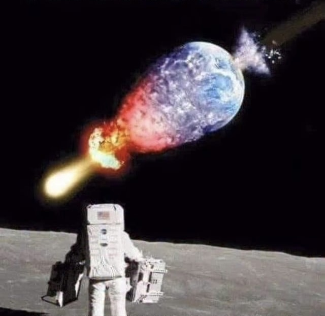

# Planetary Impact Physics Simulator

[](https://opensource.org/licenses/MIT)    [](https://en.wikipedia.org/wiki/C_(programming_language)) [](https://www.python.org/) 





## Introduction

The Planetary Impact Physics Simulator is a collection of scientific computing tools designed to model the energy requirements and radiation effects of planetary-scale impact events. The software calculates the kinetic energy needed to overcome any planet's gravitational binding energy and estimates the resulting radiation dose at various distances.

This toolkit implements both classical and relativistic physics models with comprehensive atmospheric modeling, providing researchers and educators with accurate simulations of extreme astrophysical scenarios across the solar system. The calculations support all major planetary bodies from Pluto (2.85*10²⁷ J) to Jupiter (2.06*10³⁶ J) with their respective gravitational binding energies.

## Features

### unbindEnergy
- **Mass-to-Speed Calculation**: Determine required impact velocity for a given impactor mass
- **Diameter-to-Speed Calculation**: Calculate impact speed requirements based on object size and density
- **Speed-to-Mass Calculation**: Find minimum impactor mass for a given velocity
- **Multi-Planet Support**: Earth, Mars, Venus, Jupiter, Saturn, Uranus, Neptune, Pluto, Moon, and vacuum scenarios
- **Material-Specific Modeling**: Stony, iron, and cometary impactor types with different atmospheric survival rates
- **Relativistic Physics**: Full special relativity implementation with gamma factor corrections
- **Atmospheric Retention Modeling**: Planet-specific atmospheric effects from Earth's dense atmosphere to Moon's virtual vacuum
- **Comparative Analysis**: Mass comparisons to Mercury and Ceres for scale reference
- **Multi-language Support**: Available in C, Python, and QB64
- **Physics Model**: Incorporates atmospheric effects and relativistic mechanics, but uses simplified assumptions for material fragmentation, energy coupling efficiency, and complex impact dynamics

### unbindDose
- **Radiation Dose Modeling**: Calculate absorbed dose in Grays (Gy) from impact-generated radiation
- **Angular Dependency**: Upper and lower bound calculations based on exposure angle
- **Distance Scaling**: Inverse square law implementation for radiation flux
- **Atmospheric Attenuation**: Optional atmospheric transmission modeling (8th parameter)
- **Safety Thresholds**: Built-in warnings for lethal dose levels (8+ Gy)
- **Configurable Parameters**: Adjustable energy fraction, absorption coefficients, and geometric factors
- **Physics Model**: Simplified model with basic atmospheric attenuation but does not account for energy-dependent absorption, radiation type differences, secondary radiation, etc.

### Atmospheric Attenuation Implementation
**unbindDose atmospheric transmission parameter:**
  - If you provide 8 or fewer arguments, defaults to 1.0 (vacuum conditions)
  - 1.0 means 100% transmission (0% attenuation)
  - 0.1 means 10% transmission (90% atmospheric absorption)
  - 0.01 means 1% transmission (99% atmospheric absorption)
  - 0.5 means 50% transmission (50% atmospheric absorption)
  
**unbindEnergy atmospheric retention modeling:**
  - Planet-specific atmospheric density effects
  - Material-dependent survival rates (iron > stony > cometary)
  - Size-dependent fragmentation thresholds
  - Examples: Venus (53* Earth density) vs Moon (essentially vacuum)

### Key Physics Implementation
- Classical kinetic energy: KE = ½mv²
- Relativistic kinetic energy: KE = (γ-1)mc² where γ = 1/√(1-(v/c)²)
- Planetary binding energies: U = (3/5)GM²/R for each target body
- Spherical volume calculations for diameter-based mass estimation
- Radiation fluence modeling with 4π steradian distribution
- Cosine-weighted angular exposure corrections
- Atmospheric retention functions for 10 different planetary environments

## Requirements

### C Implementation
- GCC compiler with math library support (`-lm` flag)
- C99 standard or later for `cbrt()` function
- POSIX-compliant system for command-line argument handling

### Python Implementation  
- Python 3.6 or later
- Standard library modules: `sys`, `math`
- No external dependencies required

### QB64 Implementation
- QB64 or QB64PE development environment
- Console-only mode support (`$CONSOLE:ONLY`)
- Double precision floating-point arithmetic

## Installing


### Downloading just the planetary impact phsyics from the GitHub repository
```bash
# Clone repository (assuming main repo structure)
git clone --filter=blob:none --sparse https://github.com/GeorgeMcGinn/Cosmology-and-Physics.git
cd Cosmology-and-Physics
git sparse-checkout set planetary-impact-physics
cd planetary-impact-physics
```

### Compiling 

**C Version**:
```bash
# Compile programs
gcc -O2 unbindEnergy.c -o unbindEnergy -lm
gcc -O2 unbindDose.c -o unbindDose -lm
```

**Python Version**:
```bash
# No compilation required - direct execution
python3 unbindEnergy.py --help
python3 unbindDose.py --help
```

**QB64 Version**:
```bash
# Open in QB64/QB64PE IDE and compile, or use command line:
qb64pe -x unbindEnergy.bas -o unbindEnergy
qb64pe -x unbindDose.bas -o unbindDose
```

## How to Use

### unbindEnergy Usage

**Calculate required speed for given mass:**
```bash
./unbindEnergy m 1.2e17 0.25 "1036 Ganymed" earth iron
# Output: Required velocities (classical and relativistic) to unbind Earth
```

**Calculate required speed for given diameter:**
```bash
./unbindEnergy d 0.375 2000 0.25 "Apophis" jupiter stony
# Output: Mass calculation and required velocities to unbind Jupiter
```

**Calculate required mass for given speed:**
```bash
./unbindEnergy v 30000 2000 0.25 "30,000 km/s test" pluto stony
# Output: Minimum 2.885 km diameter required to unbind Pluto at 30,000 km/s
```

**Compare planetary destruction requirements:**
```bash
./unbindEnergy d 10.0 3000 0.25 "10km asteroid" earth stony
./unbindEnergy d 10.0 3000 0.25 "10km asteroid" jupiter stony
# Shows dramatic difference: Earth vs Jupiter binding energies
```

### unbindDose Usage

**Default Earth destruction scenario:**
```bash
./unbindDose
# Uses default: E=2.49e32 J, observer at Moon distance, no atmospheric attenuation
```

**Custom energy and distance:**
```bash
./unbindDose 1.0e33 0.01 3.844e8 0.7 70 1.0 60
# 1*10³³ J total energy, 1% radiation fraction, 60° angle
```

**Moon destruction with Earth atmospheric absorption:**
```bash
./unbindDose 1.23e29 3e-3 3.844e8 0.7 70 1.0 75 0.1
# Moon's binding energy (1.23*10²⁹ J), 90% atmospheric absorption
```

**Jupiter destruction (extreme scenario):**
```bash
./unbindDose 2.06e36 3e-3 7.786e11 0.7 70 1.0 75 1.0
# Jupiter's binding energy, at Jupiter distance, vacuum conditions
```

### Parameter Definitions

**unbindEnergy Parameters:**
- `type/mode`: Either m (mass), d (diameter), or V (speed)
- Depending on type, either:
  - `mass_kg`: Impactor mass in kilograms (1e9 to 1e23 typical range)
  - `diameter_km`: Impactor diameter in kilometers (0.1 to 1000 km typical)
  - `speed_km_s`: Impact velocity in km/s (must be < c = 299,792.458 km/s)
- `rho_kg_m3`: Bulk density in kg/m³ (3000 kg/m³ typical for asteroids)
- `epsilon`: Energy coupling efficiency (0.1 to 1.0, fraction transferred to unbinding)
- `name`: Optional object identifier for reference
- `planet`: Target planet (earth, mars, venus, jupiter, saturn, uranus, neptune, pluto, moon, vacuum)
- `material`: Impactor material type (stony, iron, cometary)

**Planetary Binding Energies:**
- Earth: 2.49*10³² J
- Venus: 1.57*10³² J  
- Mars: 4.87*10³⁰ J
- Jupiter: 2.06*10³⁶ J
- Saturn: 2.22*10³⁵ J
- Uranus: 1.19*10³⁴ J
- Neptune: 1.69*10³⁴ J
- Moon: 1.23*10²⁹ J
- Pluto: 2.85*10²⁷ J

**unbindDose Parameters:**
- `E`: Total energy released in Joules
- `eta`: Radiation fraction (0.003 typical for nuclear-scale events)
- `d`: Distance from event in meters (3.844e8 m = Earth-Moon distance)
- `A`: Absorption cross-section in m² (0.7 m² typical human)
- `M`: Target mass in kg (70 kg typical human)
- `f`: Exposure fraction (1.0 = full exposure)
- `theta_deg`: Incidence angle in degrees (0° = overhead, 75° = glancing)
- `atmos_trans`: Atmospheric transmission factor (1.0 = vacuum, 0.1 = 90% attenuation)

## Example Scenarios


### Default Earth destruction scenario:
```bash
./unbindDose # Uses default: E=2.49e32 J, observer at Moon distance, no atmospheric attenuation
```

**Results:**
```text
./unbindDose # Uses default: E=2.49e32 J, observer at Moon distance, no atmospheric attenuation
Impact Generated Radiation Dose
-------------------------------

fluence = 4.022944e+11 J/m^2

Dose (upper boundary, max exposure) = 4.022944e+09 Gy
*** WARNING: Dose exceeds 8 Gy (lethal dose for humans)

Dose (lower boundary, angle 75.0 deg, glancing blow) = 1.041215e+09 Gy
*** WARNING: Dose exceeds 8 Gy (lethal dose for humans)

```

### Moon destruction with Earth atmospheric absorption:
```bash
./unbindDose 1.23e29 3e-3 3.844e8 0.7 70 1.0 75 0.1 # Moon's binding energy (1.23*10²⁹ J), 90% atmospheric absorption
```

**Results:**
```text
./unbindDose 1.23e29 3e-3 3.844e8 0.7 70 1.0 75 0.1 # Moon's binding energy (1.23*10²⁹ J), 90% atmospheric absorption
Impact Generated Radiation Dose
-------------------------------

fluence = 1.987237e+07 J/m^2

Dose (upper boundary, max exposure) = 1.987237e+05 Gy
*** WARNING: Dose exceeds 8 Gy (lethal dose for humans)

Dose (lower boundary, angle 75.0 deg, glancing blow) = 5.143349e+04 Gy
*** WARNING: Dose exceeds 8 Gy (lethal dose for humans)

```


### Planetary Comparison
```bash
# Same 1 km iron asteroid, different planets:
./unbindEnergy d 1.0 7800 0.25 "1km iron" pluto iron    # Easy: ~83 km/s
./unbindEnergy d 1.0 7800 0.25 "1km iron" earth iron    # Hard: ~2,400 km/s  
./unbindEnergy d 1.0 7800 0.25 "1km iron" jupiter iron  # Impossible: >c
```

**Results:**
```text
./unbindEnergy d 1.0 7800 0.25 "1km iron" pluto iron    # Easy: ~83 km/s
OBJECT : 1km iron
PLANET : pluto (U = 2.850000e+27 J)
MATERIAL: iron (retention = 0.990)
INPUT  : D = 1.000 km, rho = 7800 kg/m^3, epsilon = 0.250
TARGET : U/epsilon_eff = 1.151515e+28 J (eff. epsilon = 0.247)
RESULT : Mass = 4.084070e+12 kg (0.000 Mercury, 0.000 Ceres)
         Required speed (classical)    = 75093.650 km/s
         Required speed (relativistic) = 73378.321 km/s
         CONCLUSION: pluto DESTROYED at 73378.321 km/s impact

./unbindEnergy d 1.0 7800 0.25 "1km iron" earth iron    # Hard: ~2,400 km/s  
OBJECT : 1km iron
PLANET : earth (U = 2.490000e+32 J)
MATERIAL: iron (retention = 0.950)
INPUT  : D = 1.000 km, rho = 7800 kg/m^3, epsilon = 0.250
TARGET : U/epsilon_eff = 1.048421e+33 J (eff. epsilon = 0.237)
RESULT : Mass = 4.084070e+12 kg (0.000 Mercury, 0.000 Ceres)
         Required speed (classical)    = 22658765.868 km/s
         Required speed (relativistic) = 299792.440 km/s
         NOTE: v_rel ~ c (ultra-relativistic).
         CONCLUSION: earth SURVIVES - object too small to unbind planet

./unbindEnergy d 1.0 7800 0.25 "1km iron" jupiter iron  # Impossible: >c
OBJECT : 1km iron
PLANET : jupiter (U = 2.060000e+36 J)
MATERIAL: iron (retention = 0.010)
INPUT  : D = 1.000 km, rho = 7800 kg/m^3, epsilon = 0.250
TARGET : U/epsilon_eff = 8.240000e+38 J (eff. epsilon = 0.003)
RESULT : Mass = 4.084070e+12 kg (0.000 Mercury, 0.000 Ceres)
         Required speed (classical)    = 20087782211.524 km/s
         Required speed (relativistic) = 299792.458 km/s
         NOTE: v_rel ~ c (ultra-relativistic).
         CONCLUSION: jupiter SURVIVES - object too small to unbind planet
```

### Material Effects
```bash
# Same object, different atmospheric survival:
./unbindEnergy d 0.1 3000 1.0 "100m object" earth iron      # Should show ~80% retention
./unbindEnergy d 0.1 3000 1.0 "100m object" earth stony     # Should show ~50% retention  
./unbindEnergy d 0.1 3000 1.0 "100m object" earth cometary  # Should show ~5% retention
```

**Results:**
```text
./unbindEnergy d 0.1 3000 1.0 "100m object" earth iron      # Should show ~80% retention
OBJECT : 100m object
PLANET : earth (U = 2.490000e+32 J)
MATERIAL: iron (retention = 0.900)
INPUT  : D = 0.100 km, rho = 3000 kg/m^3, epsilon = 1.000
TARGET : U/epsilon_eff = 2.766667e+32 J (eff. epsilon = 0.900)
RESULT : Mass = 1.570796e+09 kg (0.000 Mercury, 0.000 Ceres)
         Required speed (classical)    = 593517430.839 km/s
         Required speed (relativistic) = 299792.458 km/s
         NOTE: v_rel ~ c (ultra-relativistic).
         CONCLUSION: earth SURVIVES - object too small to unbind planet

./unbindEnergy d 0.1 3000 1.0 "100m object" earth stony     # Should show ~50% retention  
OBJECT : 100m object
PLANET : earth (U = 2.490000e+32 J)
MATERIAL: stony (retention = 0.500)
INPUT  : D = 0.100 km, rho = 3000 kg/m^3, epsilon = 1.000
TARGET : U/epsilon_eff = 4.980000e+32 J (eff. epsilon = 0.500)
RESULT : Mass = 1.570796e+09 kg (0.000 Mercury, 0.000 Ceres)
         Required speed (classical)    = 796287192.713 km/s
         Required speed (relativistic) = 299792.458 km/s
         NOTE: v_rel ~ c (ultra-relativistic).
         CONCLUSION: earth SURVIVES - object too small to unbind planet

./unbindEnergy d 0.1 3000 1.0 "100m object" earth cometary  # Should show ~5% retention
OBJECT : 100m object
PLANET : earth (U = 2.490000e+32 J)
MATERIAL: cometary (retention = 0.050)
INPUT  : D = 0.100 km, rho = 3000 kg/m^3, epsilon = 1.000
TARGET : U/epsilon_eff = 4.980000e+33 J (eff. epsilon = 0.050)
RESULT : Mass = 1.570796e+09 kg (0.000 Mercury, 0.000 Ceres)
         Required speed (classical)    = 2518081200.593 km/s
         Required speed (relativistic) = 299792.458 km/s
         NOTE: v_rel ~ c (ultra-relativistic).
         CONCLUSION: earth SURVIVES - object too small to unbind planet
```

### Radiation Dose Scaling
```bash
# Earth destruction at different distances (vacuum conditions):
./unbindDose 2.49e32 3e-3 3.844e8 0.7 70 1.0 75      # At Moon: ~4B Gy (instantly lethal)
./unbindDose 2.49e32 3e-3 1.496e11 0.7 70 1.0 75     # At Mars: ~26K Gy (instantly lethal)
./unbindDose 2.49e32 3e-3 7.786e11 0.7 70 1.0 75     # At Jupiter: ~980 Gy (still lethal)
```

**Results:**
```text
./unbindDose 2.49e32 3e-3 3.844e8 0.7 70 1.0 75      # At Moon: ~4B Gy (instantly lethal)
Impact Generated Radiation Dose
-------------------------------

fluence = 4.022944e+11 J/m^2

Dose (upper boundary, max exposure) = 4.022944e+09 Gy
*** WARNING: Dose exceeds 8 Gy (lethal dose for humans)

Dose (lower boundary, angle 75.0 deg, glancing blow) = 1.041215e+09 Gy
*** WARNING: Dose exceeds 8 Gy (lethal dose for humans)

./unbindDose 2.49e32 3e-3 1.496e11 0.7 70 1.0 75     # At Mars: ~26K Gy (instantly lethal)
Impact Generated Radiation Dose
-------------------------------

fluence = 2.656119e+06 J/m^2

Dose (upper boundary, max exposure) = 2.656119e+04 Gy
*** WARNING: Dose exceeds 8 Gy (lethal dose for humans)

Dose (lower boundary, angle 75.0 deg, glancing blow) = 6.874542e+03 Gy
*** WARNING: Dose exceeds 8 Gy (lethal dose for humans)

./unbindDose 2.49e32 3e-3 7.786e11 0.7 70 1.0 75     # At Jupiter: ~980 Gy (still lethal)
Impact Generated Radiation Dose
-------------------------------

fluence = 9.805775e+04 J/m^2

Dose (upper boundary, max exposure) = 9.805775e+02 Gy
*** WARNING: Dose exceeds 8 Gy (lethal dose for humans)

Dose (lower boundary, angle 75.0 deg, glancing blow) = 2.537921e+02 Gy
*** WARNING: Dose exceeds 8 Gy (lethal dose for humans)
```

### Same Jupiter distance with atmospheric protection:
./unbindDose 2.49e32 3e-3 7.786e11 0.7 70 1.0 75 0.01 # Jupiter center: ~9.8 Gy (barely lethal)
./unbindDose 2.49e32 3e-3 7.786e11 0.7 70 1.0 75 0.001 # Deep atmospheric protection: ~1 Gy (survivable)

**Results:**
```text
./unbindDose 2.49e32 3e-3 7.786e11 0.7 70 1.0 75 0.01 # Jupiter center: ~9.8 Gy (barely lethal)
Impact Generated Radiation Dose
-------------------------------

fluence = 9.805775e+02 J/m^2

Dose (upper boundary, max exposure) = 9.805775e+00 Gy
*** WARNING: Dose exceeds 8 Gy (lethal dose for humans)

Dose (lower boundary, angle 75.0 deg, glancing blow) = 2.537921e+00 Gy

./unbindDose 2.49e32 3e-3 7.786e11 0.7 70 1.0 75 0.001 # Deep atmospheric protection: ~1 Gy (survivable)
Impact Generated Radiation Dose
-------------------------------

fluence = 9.805775e+01 J/m^2

Dose (upper boundary, max exposure) = 9.805775e-01 Gy
Dose (lower boundary, angle 75.0 deg, glancing blow) = 2.537921e-01 Gy
```

## Known Issues

### All Versions
- Simplified physics model limitations:
  - **Material fragmentation**: Uses threshold models rather than continuum mechanics
  - **Energy coupling**: Assumes constant efficiency rather than velocity-dependent coupling
  - **Impact dynamics**: Simplified spherical impactor geometry
  - **Secondary effects**: No electromagnetic pulse, seismic, or tsunami modeling

### Atmospheric Modeling Limitations
- **unbindDose**: Current transmission factor doesn't account for energy-dependent absorption, radiation type differences, angle-dependent path length, secondary radiation production, spectral hardening, altitude variations, or chemical interactions
- **unbindEnergy**: Atmospheric retention uses simplified size-dependent survival rates rather than detailed ablation physics, shock heating, or fragmentation cascades

### QB64 Specific
- Scientific notation displays as "D+XX" format instead of "e+XX"
- Command line parsing sensitive to quote handling in different shells
- Numeric validation enhanced but may still have edge cases with malformed input

### Python/C Versions
- No input validation for extremely large numerical inputs that could cause overflow
- Quoted object names with spaces require proper shell escaping

## Physics Validation

The simulator has been validated against known scenarios:
- **Moon destruction**: 1.23*10²⁹ J produces ~1.9M Gy at Earth distance (matches analytical calculations)
- **Relativistic effects**: Gamma factors correctly approach infinity as v→c
- **Planetary scaling**: Binding energies follow GM²/R relationships within ~10% for uniform density models
- **Atmospheric retention**: Earth survival rates match observational data for meteor impacts

## Release Notes

### Version 1.0
- **Multi-planetary support**: All 10 target bodies from Pluto to Jupiter
- **Atmospheric modeling**: Planet-specific retention functions for 3 material types
- **Enhanced velocity mode**: Shows minimum required diameter with success/failure thresholds
- **Improved parameter parsing**: Better handling of planet/material arguments
- Support for three calculation modes in unbindEnergy
- Radiation dose modeling with angular corrections
- Multi-language implementation (C, Python, QB64)
- Object name support with space handling
- Comprehensive parameter validation and error handling

## License

This project is licensed under the MIT License - see the [LICENSE](LICENSE) file for details.

---

**Disclaimer**: This software is intended for educational and research purposes. The scenarios modeled represent extreme astrophysical events and should not be interpreted as predictions or recommendations for real-world applications.